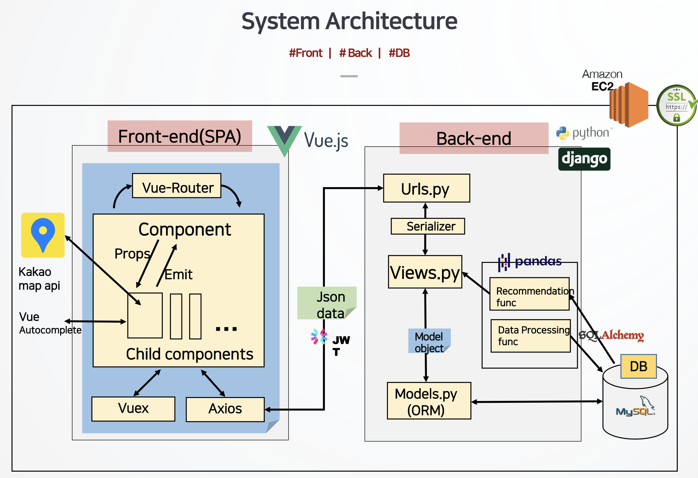
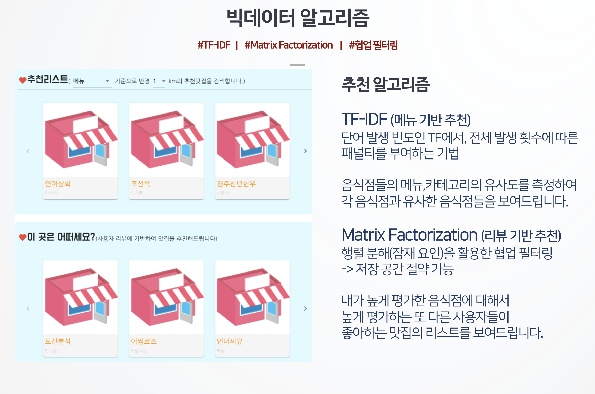
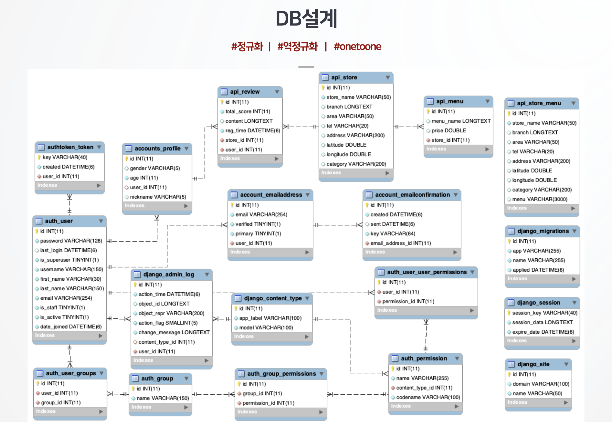

# 세명맛집 : 빅데이터 알고리즘을 활용한 맛집 추천 서비스

## '세상 유명한 맛집을 모두 모았다' 라는 의미

Front는 `Vue`로 구성했고 백엔드는 `Django Framework`를 사용하여 RESTful하게 구현했습니다.

Front에서는 `KAKAO MAP API`를 이용해 지도 정보를 가져왔고

`vue-autocomplete`를 이용해 검색시 자동완성을 구현했습니다.

Back에서는 `Pandas`를 이용해 데이터를 가공 및 분석했고

사용자 인증에는 `jwt 토큰`을 사용했습니다.

## TF-IDF 알고리즘

데이터 분석 시 많이 등장하는 단어에 무조건 가산점을 준다면, 유의미한 결과를 얻기 힘들 때가 많습니다.

TF-IDF는 이를 보완한 알고리즘으로서 단순히 많이 등장한다고 해서 그 단어의 가치를 정하는 것이 아니라,

많이 등장하는 단어에는 일종의 패널티를 줌으로서 단어 빈도의 스케일을 맞춰주는 기법입니다.

## Matrix Factorization 알고리즘

Matrix Factorization 알고리즘이 자주 쓰이는 이유는

행렬 분해를 이용하여 잠재 요인을 끌어냈을 때 저장 공간을 절약할 수 있기 때문입니다.

<!-- ## 컨셉

음식점 검색 뿐 아니라

내 위치, 내 리뷰 등에 기반한 추천 알고리즘을 통해 추천 음식점 목록까지 볼 수 있는 사이트

## 기능

### 주변 음식점 정보

- 주변 음식점들의 위치를 지도에 표시
- 클릭하면 상세 페이지로 이동)

### 테마 음식점

- 최다 리뷰, 최고 별점 등 사용자의 이목을 끌만한 다양한 테마별로 음식점들을 순위별로 보여줌

- 마우스를 올리면(hover) 자세한 음식점 정보를 볼 수 있고, 클릭하면 상세 페이지로 이동

### 나의 음식점

- 사용자의 검색 history 또는 즐겨찾기에 기반야여 추천 음식점을 보여줌
- 내가 즐겨찾기한 음식점 목록을 볼 수 있음
- 마우스를 올리면(hover) 자세한 음식점 정보를 볼 수 있고, 클릭하면 상세 페이지로 이동

### About us

- 개발자 정보를 보여주는 페이지
- 회원정보를 볼 수 있는 페이지

## 역할
- 김주희 : 로그인/회원가입, Matrix Factorization 알고리즘, 사용자 정보 기반 추천 알고리즘, jira 담당
- 이재혁 : db설계 및 Matrix Factorization 알고리즘, 팀장
- 김태민 : rest 설계 및 front 담당, git 담당

## 사용 기술
- back : django, python 라이브러리
- front : vue
- db : mysql
- 형상관리 : git, jira -->
