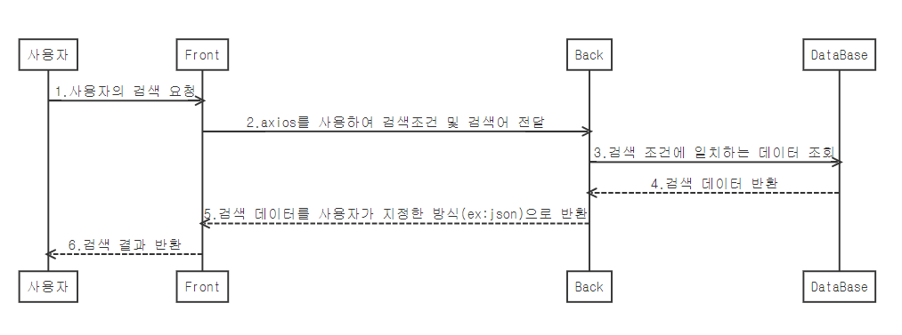

# Sequence Diagram

### 상품 검색 기능의 통신 흐름

```sequence
사용자 ->> Front : 1.사용자의 검색 요청
Front ->> Back : 2.axios를 사용하여 검색조건 및 검색어 전달
Back ->> DataBase : 3.검색 조건에 일치하는 데이터 조회
DataBase -->> Back : 4.검색 데이터 반환
Back -->> Front : 5.검색 데이터를 사용자가 지정한 방식(ex:json)으로 반환
Front -->> 사용자 : 6.검색 결과 반환
```

> git의 md 엔진에 mermaid 라이브러리가 반영되어 있지 않아서 sequence diagram이 보이지 않는 관계로 캡쳐 이미지를 별도로 첨부합니다.




### 메세지 종류

- 동기 메세지 : 색칠된 화살표

- 비동기 메세지 : 빈 화살표 (→)

- 반환 메세지 : 점선으로 표기


### 비고

​	vue에서 axios를 활용하여 비동기 통신을 하므로 전체 과정을 비동기 메세지로 표기